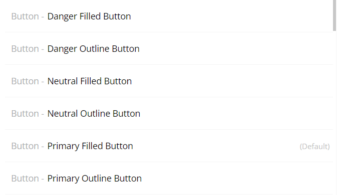

# Style naming

Style naming is always complex, regardless of your work being in traditional code or no-code. Atomic design, tokenization in design system, etc have always driven developers crazy. Bubble, with its lack of cascading, actually makes it easier for us to name styles because we cannot create atomic styles to apply to elements and we have to make sure our styles are lean enough for the ease of management.

Before going into naming, let's start with a bit of analysis.

## Styles management

Here we analyze the common use of styles in projects.&#x20;

### Base styles

It is recommended to build a well-defined design system that you can reuse as a base before starting any project and modify the styles in that project with your custom variants. This creates a consistent experience from the design stage to the development stage of a project. The base styles will be the most common, basic variants of usage that you see throughout the majority of projects.

Bubble's style variables have already given us the clue to the common usage of styles. They are **Primary**, **Secondary**, **Success**, **Danger** (or **Destructive**), **Alert** (or **Notice**), **Neutral** (or **Default**), **Background** and **Surface**. These variants usually dictate the color of the element. You should certainly use these for color variables.

Hence, for **non-text elements** (groups, buttons, inputs, anything but texts), it is recommended to break the use cases into multiple usage variants. However, we can even break each variant into 2 smaller variants: **Filled** (colored background) and **Outlined** (colored border).&#x20;

<figure><figcaption>
Examples of the variants
</figcaption></figure>

**Text elements** also come in different uses: **Heading** and **Paragraph**. Those should be the types that come first in a name.

**Text elements** also usually vary in size. Hence, a size-based approach to breaking down the styles is recommended. Sizes can either be **H1** to **H6** or **XXL** to **XXS**.&#x20;

<figure><figcaption>
Examples of text variants
</figcaption></figure>

For **non-text elements** **with texts** like buttons or inputs, we didn't find a lot of cases where you would need custom font sizes or font colors for the buttons or inputs with the same color, so we didn't include those in the base styles.

### Weight and color variants of text elements

Occasionally, text elements require variants with custom weights or colors. In these cases, you can add variants with custom weights and colors.

For example: **Heading XL 500 Primary** (obviously you should avoid using custom colors that are not in the color variables, and please don't use color code in the name, unless you are a robot).

### Border radius and shadow

Usually, border radius and shadow only vary when an element varies in size (e.g. a group needs smaller border radius and shadow when it is smaller). In this case, you can add additional label after the basic variant name.

For example: **Neutral Filled 8r Light-Shadow**&#x20;

However, because they follow sizes, we can simplify the name to **Neutral Filled Large** or **Neutral Filled Small**

### Padding

Padding goes with size so following the above example is good enough. However, padding is usually customized a lot due to different usage and sizing in elements, so variants should not be produced and you should stick to inline styling.

### Interactions

We didn't find a lot of cases where the same style with different interaction behaviors, so variants are recommended to be overriden as well.

## Naming

In conclusion:

* No need to place Button or Group in front of or behind a style name, because Bubble has already provided that.
* For non-text elements: **Type** - **Background - \[Optional] Size variant**\
  Example: **Primary Outlined Large**
* For text elements: **Type** - **Size** - **\[Optional] Color variant** - **\[Optional] Weight variant**\
  Example: **Heading XL Danger 500**

In an extreme case where you need to have so many variants, just start listing all the variants one after another.
